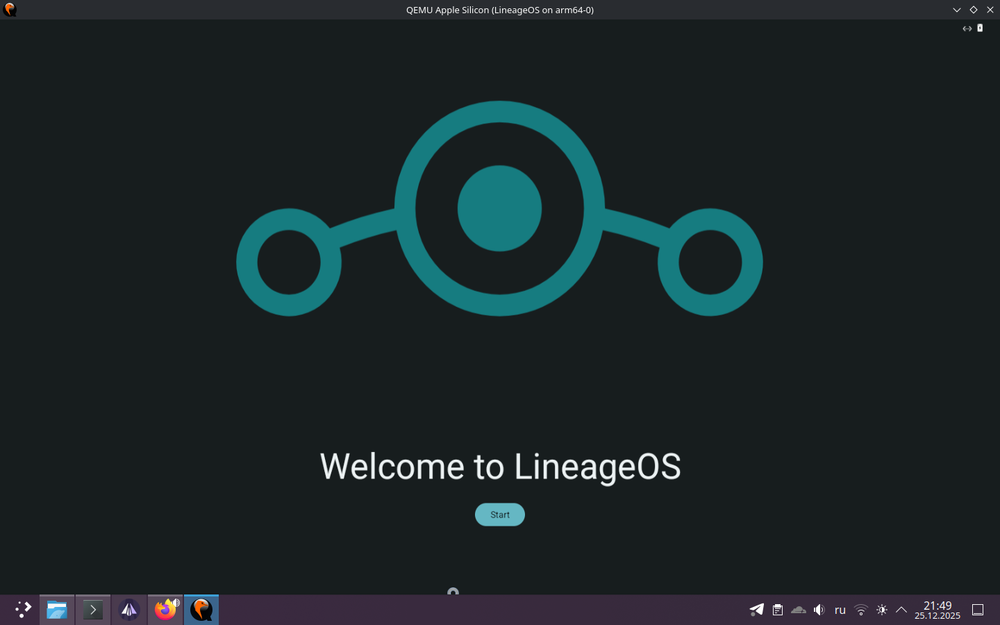
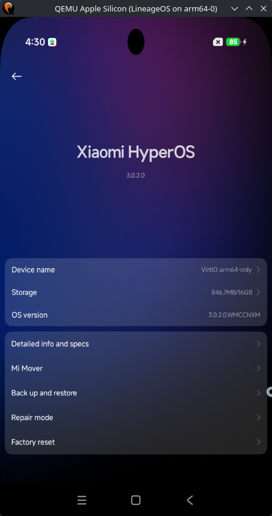

# android-lineage-qemu


Run LineageOS and GSI images on QEMU virtualization for aarch64 architecture. This project enables Android emulation without physical devices. 

## Screenshots
*LineageOS 20.0 running on QEMU with hardware acceleration*


*HyperOS 3 GSI successfully booted*



## Getting Started

1. Go to **[Releases](https://github.com/SamuraiArtem/android-lineage-emulator/releases)**  
2. Download the latest release archive
3. Extract and enter the directory
4.For Linux, you need to install qemu-system-aarch64
***Ubuntu / Debian / Linux Mint***
```bash
sudo apt install qemu-system-arm qemu-efi-aarch64
```
***Arch Linux / Manjaro***
```bash
sudo pacman -S qemu-system-aarch64
```

### Running LineageOS
```bash
./run_vm.sh

```
or on Windows:
```bat
run_vm.bat
```
Connect to the emulated device:
```bash
adb connect localhost:5555
fastboot -s tcp:localhost:5554
```

### Running GSI
✅ Confirmed working: **HyperOS 3**

1. Rename your GSI image to `system.img` and place it in the same directory as `run_vm_gsi.sh` / `run_vm_gsi.bat`  
   (e.g. `HyperOS_3.img` → `system.img`)

2. Launch GSI mode:
   ```bash
   ./run_vm_gsi.sh
   ```
   or on Windows:
```bat
run_vm_gsi.bat
```
3. **First-time setup (required before GSI boot):**
   - First, boot LineageOS using `./run_vm.sh` (or `run_vm.bat`)
   - In the VM: **Settings** → **Developer options** → **SELinux** → **Permissive**
   - Reboot → In boot menu: **Advanced options** → **Boot GSI from /dev/block/vdc**

> ⚠️ The GSI must be:  
> - ARM64, raw `.img` format 

## Contact

For questions, support, or collaboration:
 **Telegram:** [@Qwekte](https://t.me/Qwekte )

 ## Build Sources

This project utilizes unofficial LineageOS build for QEMU from:
🔗 **[jqssun/android-lineage-qemu](https://github.com/jqssun/android-lineage-qemu/)**

Special thanks to:
- [jqssun](https://github.com/jqssun ) for excellent LineageOS builds for QEMU
- LineageOS community for outstanding development
- QEMU team for powerful virtualization technology
